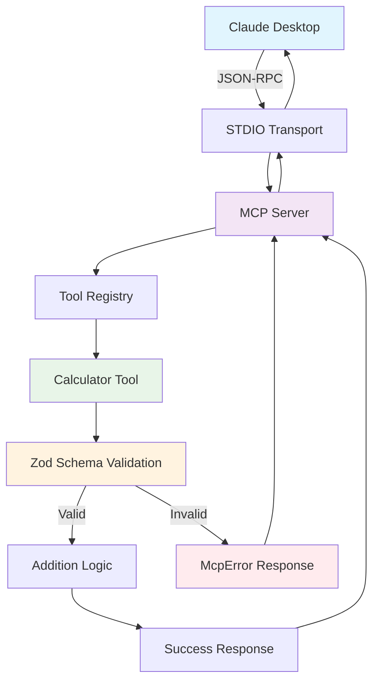
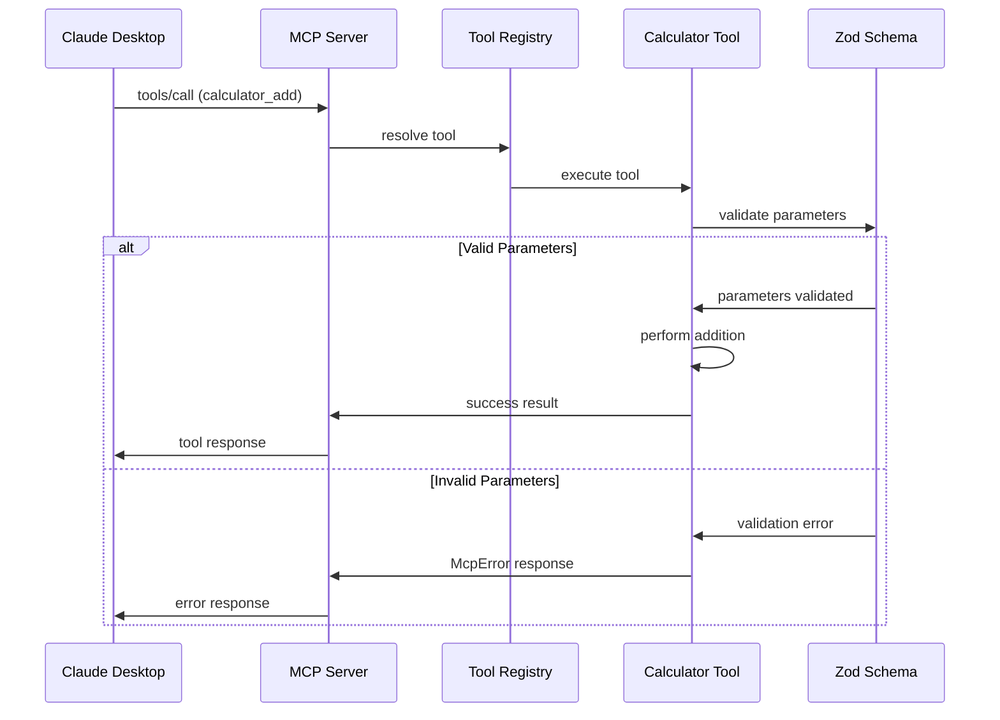

# MCP Boilerplate v0 Build Plan

**Target**: Minimal MCP server with single addition tool  
**Audience**: Junior engineers needing comprehensive guidance  
**Research Base**: FastMCP 2.0.1, MCP SDK v1.17.0, 9 GitHub repositories analyzed  
**Focus**: Production-ready patterns with educational clarity  

---

## 🎯 Project Objectives

### Primary Goals
1. **Minimal Viable Product**: Single addition tool proving MCP integration
2. **Educational Value**: Clear, documented patterns for learning MCP development
3. **Production Foundation**: Security, error handling, and extensibility patterns
4. **Developer Experience**: Modern tooling with TypeScript, linting, and testing

### Success Criteria
**Primary Success Requirements:**
- [ ] MCP server builds successfully without errors
- [ ] MCP server connects and establishes communication via STDIO transport
- [ ] Simple math addition tool works when called and returns expected results
- [ ] All testing performed directly within Claude Code environment

**Secondary Quality Requirements:**
- [ ] Comprehensive input validation with Zod schemas
- [ ] Proper error handling using McpError for protocol issues
- [ ] TypeScript type safety throughout codebase
- [ ] Clean, extensible architecture for additional tools

---

## 🏗️ Architecture Overview

### Technology Stack Decision Matrix

| Component | Choice | Version | Justification |
|-----------|--------|---------|---------------|
| **Language** | TypeScript | Latest | Type safety, IDE support, 56% of analyzed repos |
| **MCP Framework** | MCP SDK | v1.17.0 | Official, stable, latest 2025-06-18 protocol |
| **Validation** | Zod | Latest | Type inference, security, MCP SDK integration |
| **Transport** | STDIO | Built-in | Simplest for local development, standard |
| **Build Tool** | TypeScript | 5.x | Native compilation, no complexity |
| **Package Manager** | npm | Latest | Universal compatibility |

### Project Structure

```
mcp-boilerplate/
├── package.json                 # Dependencies and scripts
├── tsconfig.json               # TypeScript configuration
├── .eslintrc.json              # Linting rules
├── .prettierrc                 # Code formatting
├── README.md                   # Main documentation
├── CONTRIBUTING.md             # Development guide
├── LICENSE                     # MIT license
├── .gitignore                  # Git exclusions
│
├── src/                        # Source code
│   ├── index.ts               # Server entry point
│   ├── server.ts              # MCP server setup
│   ├── tools/                 # Tool implementations
│   │   ├── index.ts          # Tool registry
│   │   └── calculator.ts     # Addition tool
│   ├── schemas/               # Zod validation schemas
│   │   ├── index.ts          # Schema exports
│   │   └── calculator.ts     # Calculator schemas
│   ├── types/                 # TypeScript definitions
│   │   ├── index.ts          # Type exports
│   │   └── tools.ts          # Tool-specific types
│   └── utils/                 # Utility functions
│       ├── index.ts          # Utility exports
│       ├── errors.ts         # Error handling utilities
│       └── validation.ts     # Validation helpers
│
├── dist/                       # Compiled JavaScript (generated)
├── docs/                       # Documentation
│   ├── api/                   # API documentation
│   ├── examples/              # Usage examples
│   └── guides/                # Setup and usage guides
│
└── tests/                      # Test files
    ├── tools/                 # Tool tests
    ├── schemas/               # Schema tests
    └── integration/           # End-to-end tests
```

---

## 🔄 Data Flow Architecture



### Request Flow Sequence



---

## 📋 Implementation Phases

### Phase 1: Project Foundation (1-2 hours)

#### 1.1 Project Initialization
```bash
# Commands to run:
npm init -y
npm install @modelcontextprotocol/sdk zod
npm install -D typescript @types/node eslint @typescript-eslint/parser @typescript-eslint/eslint-plugin prettier
npx tsc --init
```

#### 1.2 Configuration Files Setup

**package.json scripts section:**
```json
{
  "scripts": {
    "build": "tsc",
    "dev": "tsc --watch",
    "start": "node dist/index.js",
    "lint": "eslint src/**/*.ts",
    "lint:fix": "eslint src/**/*.ts --fix",
    "format": "prettier --write src/**/*.ts",
    "test": "echo \"Tests not implemented yet\" && exit 1"
  }
}
```

**Key Configuration Decisions:**
- TypeScript target: ES2022 (modern Node.js support)
- Module system: CommonJS (MCP SDK compatibility)
- Strict mode: Enabled (type safety)
- Source maps: Enabled (debugging support)

#### 1.3 Development Tooling

**ESLint Configuration Priorities:**
1. TypeScript strict rules
2. Security-focused rules (no-eval, no-implied-eval)
3. Code quality rules (no-unused-vars, no-console in production)
4. Consistent formatting integration with Prettier

### Phase 2: Core MCP Server Implementation (2-3 hours)

#### 2.1 Server Entry Point (`src/index.ts`)

**Critical Implementation Details:**
```typescript
#!/usr/bin/env node

import { createServer } from './server.js';

// GOTCHA: Must handle process termination gracefully
process.on('SIGINT', () => {
  console.error('Received SIGINT, shutting down gracefully');
  process.exit(0);
});

process.on('SIGTERM', () => {
  console.error('Received SIGTERM, shutting down gracefully');
  process.exit(0);
});

// GOTCHA: Catch unhandled errors to prevent silent failures
process.on('unhandledRejection', (reason, promise) => {
  console.error('Unhandled Rejection at:', promise, 'reason:', reason);
  process.exit(1);
});

async function main() {
  try {
    const server = createServer();
    await server.connect();
  } catch (error) {
    console.error('Failed to start MCP server:', error);
    process.exit(1);
  }
}

main();
```

**Pitfalls to Avoid:**
- ❌ Missing shebang line prevents direct execution
- ❌ No process signal handlers cause ungraceful shutdowns
- ❌ Unhandled promise rejections cause silent failures
- ❌ Missing .js extensions in imports break CommonJS output

#### 2.2 MCP Server Setup (`src/server.ts`)

**Architecture Pattern:**
```typescript
import { Server } from '@modelcontextprotocol/sdk/server/index.js';
import { StdioServerTransport } from '@modelcontextprotocol/sdk/server/stdio.js';
import { CallToolRequestSchema, ListToolsRequestSchema } from '@modelcontextprotocol/sdk/types.js';
import { toolRegistry } from './tools/index.js';

export function createServer(): Server {
  const server = new Server({
    name: 'mcp-boilerplate',
    version: '1.0.0',
  }, {
    capabilities: {
      tools: {},  // IMPORTANT: Enable tools capability
    },
  });

  // GOTCHA: Must register handlers before connecting
  setupToolHandlers(server);
  
  // GOTCHA: Use STDIO transport for Claude Desktop compatibility
  const transport = new StdioServerTransport();
  server.connect(transport);
  
  return server;
}
```

**Critical Implementation Notes:**
- Tools capability must be explicitly enabled
- Handler registration must occur before connection
- STDIO transport is required for Claude Desktop
- Server name/version should match package.json

### Phase 3: Tool Implementation (2-3 hours)

#### 3.1 Calculator Tool (`src/tools/calculator.ts`)

**Complete Implementation with Error Handling:**
```typescript
import { z } from 'zod';
import { McpError, ErrorCode } from '@modelcontextprotocol/sdk/types.js';
import { CalculatorAddSchema, CalculatorAddInput } from '../schemas/calculator.js';

export const calculatorTool = {
  name: 'calculator_add',
  description: 'Add two numbers together',
  inputSchema: CalculatorAddSchema,
  
  async execute(params: CalculatorAddInput) {
    try {
      // SECURITY: Zod validation happens before this point
      const { a, b } = params;
      
      // GOTCHA: Handle edge cases that Zod might miss
      if (!Number.isFinite(a) || !Number.isFinite(b)) {
        throw new McpError(
          ErrorCode.InvalidParams,
          'Numbers must be finite values'
        );
      }
      
      const result = a + b;
      
      // GOTCHA: Check for overflow
      if (!Number.isFinite(result)) {
        throw new McpError(
          ErrorCode.InvalidParams,
          'Result overflow: numbers too large'
        );
      }
      
      return {
        content: [
          {
            type: 'text',
            text: `${a} + ${b} = ${result}`
          }
        ]
      };
      
    } catch (error) {
      // GOTCHA: Distinguish between McpError and unexpected errors
      if (error instanceof McpError) {
        throw error;
      }
      
      // Log unexpected errors for debugging
      console.error('Unexpected error in calculator_add:', error);
      throw new McpError(
        ErrorCode.InternalError,
        'An unexpected error occurred during calculation'
      );
    }
  }
};
```

#### 3.2 Zod Schema Implementation (`src/schemas/calculator.ts`)

**Security-First Validation:**
```typescript
import { z } from 'zod';

// SECURITY: Comprehensive number validation
const SafeNumberSchema = z.number()
  .finite('Number must be finite')
  .safe('Number must be within safe integer range')
  // GOTCHA: Prevent JSON precision issues
  .refine((n) => Number.isFinite(n), 'Invalid number format')
  // SECURITY: Reasonable bounds to prevent DoS
  .min(-1e10, 'Number too small')
  .max(1e10, 'Number too large');

export const CalculatorAddSchema = z.object({
  a: SafeNumberSchema.describe('First number to add'),
  b: SafeNumberSchema.describe('Second number to add'),
}).strict(); // SECURITY: Reject unknown properties

export type CalculatorAddInput = z.infer<typeof CalculatorAddSchema>;
```

**Validation Security Considerations:**
- ✅ Finite number validation prevents NaN/Infinity
- ✅ Safe integer range prevents precision loss
- ✅ Reasonable bounds prevent DoS attacks
- ✅ Strict schema rejects unknown properties
- ✅ Descriptive error messages for better UX

### Phase 4: Error Handling Strategy (1-2 hours)

#### 4.1 Error Utility Functions (`src/utils/errors.ts`)

**Comprehensive Error Handling:**
```typescript
import { McpError, ErrorCode } from '@modelcontextprotocol/sdk/types.js';
import { ZodError } from 'zod';

export function handleZodError(error: ZodError): McpError {
  const firstIssue = error.issues[0];
  const message = `Validation failed: ${firstIssue.message} at ${firstIssue.path.join('.')}`;
  
  return new McpError(
    ErrorCode.InvalidParams,
    message,
    { zodError: error.format() } // Include structured error data
  );
}

export function createValidationError(message: string, field?: string): McpError {
  return new McpError(
    ErrorCode.InvalidParams,
    field ? `${field}: ${message}` : message
  );
}

export function createInternalError(message: string, originalError?: unknown): McpError {
  // SECURITY: Don't expose internal error details in production
  const isNonProd = process.env.NODE_ENV !== 'production';
  
  return new McpError(
    ErrorCode.InternalError,
    message,
    isNonProd && originalError ? { originalError: String(originalError) } : undefined
  );
}
```

#### 4.2 Error Handling Best Practices

**Tool Error vs Protocol Error Decision Tree:**
```
Error occurs in tool
├── Validation Error (bad input)
│   └── Return McpError with InvalidParams
├── Business Logic Error (expected failure)
│   └── Return tool result with isError: true
├── Resource Not Found
│   └── Return McpError with appropriate code
└── Unexpected Error
    ├── Log error details
    └── Return McpError with InternalError
```

### Phase 5: Claude Code Testing Strategy (1-2 hours)

#### 5.1 Direct Testing in Claude Code Environment

**Testing Approach:**
The MCP server will be tested directly within Claude Code using the built-in MCP capabilities. This provides the most realistic testing environment since Claude Code is an MCP client itself.

**Testing Steps:**
1. **Build Verification**: Ensure TypeScript compilation succeeds
2. **Server Startup**: Test MCP server initialization and STDIO transport
3. **Connection Testing**: Verify Claude Code can discover and connect to the server
4. **Tool Discovery**: Confirm calculator_add tool is properly registered
5. **Functional Testing**: Execute addition operations with various inputs
6. **Error Handling Testing**: Validate error responses for invalid inputs

#### 5.2 Test Cases to Execute in Claude Code

**Basic Functionality Tests:**
```bash
# Test 1: Simple positive numbers
# Expected: Successful addition
add(5, 3) → "5 + 3 = 8"

# Test 2: Negative numbers
# Expected: Correct handling of negatives
add(-2, 7) → "-2 + 7 = 5"

# Test 3: Decimal numbers
# Expected: Precise decimal arithmetic
add(1.5, 2.7) → "1.5 + 2.7 = 4.2"

# Test 4: Zero values
# Expected: Correct zero handling
add(0, 5) → "0 + 5 = 5"
```

**Error Handling Tests:**
```bash
# Test 5: Invalid input (non-numeric)
# Expected: Zod validation error
add("hello", 5) → ValidationError

# Test 6: Missing parameters
# Expected: Schema validation error
add(5) → ValidationError

# Test 7: Out of bounds numbers
# Expected: Range validation error
add(1e15, 1e15) → ValidationError
```

#### 5.3 Success Validation Checklist

**Connection Success Indicators:**
- [ ] MCP server starts without errors
- [ ] Claude Code recognizes the MCP server
- [ ] Tool list includes `calculator_add`
- [ ] Tool description is properly displayed

**Functional Success Indicators:**
- [ ] Basic addition returns correct results
- [ ] Negative numbers handled correctly
- [ ] Decimal precision maintained
- [ ] Error messages are clear and helpful

**Performance Success Indicators:**
- [ ] Tool responses within 100ms
- [ ] No memory leaks during operation
- [ ] Graceful server shutdown on termination

### Phase 6: Documentation & Examples (1-2 hours)

#### 6.1 README.md Structure
1. **Quick Start** - 30-second setup
2. **Installation** - Step-by-step guide
3. **Claude Desktop Integration** - Configuration instructions
4. **API Reference** - Tool documentation
5. **Development** - Contributing guide
6. **Troubleshooting** - Common issues

#### 6.2 Claude Desktop Integration Guide

**Configuration Template:**
```json
{
  "mcpServers": {
    "mcp-boilerplate": {
      "command": "node",
      "args": ["/path/to/mcp-boilerplate/dist/index.js"],
      "env": {
        "NODE_ENV": "production"
      }
    }
  }
}
```

---

## ⚠️ Critical Gotchas & Pitfalls

### 1. **CommonJS vs ES Modules**
- **Issue**: MCP SDK uses CommonJS, mixing module systems causes errors
- **Solution**: Use `.js` extensions in imports, configure tsconfig for CommonJS output
- **Detection**: Build failures with "Cannot find module" errors

### 2. **STDIO Transport Buffering**
- **Issue**: Large responses can cause buffer overflow in STDIO
- **Solution**: Keep tool responses concise, chunk large data
- **Detection**: Truncated responses or connection drops

### 3. **Error Handling Levels**
- **Issue**: Confusing protocol errors with tool errors
- **Solution**: Use McpError for protocol issues, tool result errors for business logic
- **Detection**: Claude Desktop shows generic error messages

### 4. **Zod Schema Strictness**
- **Issue**: Overly permissive schemas allow malicious input
- **Solution**: Use `.strict()`, add refinements for security
- **Detection**: Unexpected behavior with malformed input

### 5. **Process Lifecycle Management**
- **Issue**: Server doesn't shutdown gracefully, leaving zombie processes
- **Solution**: Handle SIGINT/SIGTERM signals properly
- **Detection**: Multiple server processes running simultaneously

### 6. **TypeScript Path Resolution**
- **Issue**: Import paths work in development but fail in production
- **Solution**: Use relative paths with `.js` extensions
- **Detection**: Runtime "Cannot find module" errors

---

## 🔒 Security Checklist

### Input Validation
- [ ] All tool parameters validated with Zod schemas
- [ ] Numeric bounds prevent DoS attacks
- [ ] String length limits enforced
- [ ] No arbitrary code execution paths

### Error Handling
- [ ] Internal errors don't expose sensitive information
- [ ] Stack traces filtered in production
- [ ] Error messages are user-friendly but not revealing

### General Security
- [ ] No eval() or similar dynamic code execution
- [ ] File paths validated and sanitized
- [ ] Environment variables used for sensitive configuration
- [ ] Dependencies regularly updated

---

## 📈 Performance Considerations

### Response Time Targets
- **Tool Execution**: < 100ms for simple operations
- **Schema Validation**: < 10ms per request
- **Memory Usage**: < 50MB baseline
- **Startup Time**: < 2 seconds

### Optimization Strategies
1. **Schema Compilation**: Pre-compile Zod schemas
2. **Error Caching**: Cache common error responses
3. **Lazy Loading**: Load tools on-demand for larger servers
4. **Connection Pooling**: For external resource access

---

## 🚀 Deployment & Distribution

### Development Setup
```bash
git clone <repo>
cd mcp-boilerplate
npm install
npm run build
npm start  # Test server directly
```

### Claude Desktop Integration
1. Build the project: `npm run build`
2. Copy `dist/` directory to desired location
3. Update Claude Desktop configuration
4. Restart Claude Desktop
5. Test with simple addition query

### Distribution Strategy
- **npm package**: For easy installation
- **GitHub template**: For customization
- **Docker image**: For containerized deployment
- **Pre-built binaries**: For non-Node environments

---

## 📊 Success Metrics

### Primary Success Metrics (Must Pass)
- [ ] **Build Success**: TypeScript compilation completes without errors
- [ ] **Connection Success**: MCP server connects to Claude Code via STDIO transport
- [ ] **Tool Registration**: calculator_add tool appears in Claude Code's available tools
- [ ] **Basic Functionality**: Simple addition (5 + 3 = 8) works correctly
- [ ] **Error Handling**: Invalid inputs return appropriate error messages

### Claude Code Integration Tests
- [ ] **Server Discovery**: Claude Code recognizes and loads the MCP server
- [ ] **Tool Execution**: Addition tool executes successfully when called
- [ ] **Response Format**: Tool responses display correctly in Claude Code
- [ ] **Error Display**: Validation errors are clearly shown to the user
- [ ] **Performance**: Tool responses complete within reasonable time (<2 seconds)

### Code Quality Metrics (Secondary)
- [ ] TypeScript strict mode enabled with no compiler warnings
- [ ] Zod schemas provide comprehensive input validation
- [ ] Error handling covers all edge cases
- [ ] Code follows consistent formatting standards

### Extensibility Validation
- [ ] Additional tools can be easily added to the registry
- [ ] Schema patterns are reusable for new tools
- [ ] Server architecture supports multiple tool types
- [ ] Clear documentation for extending the boilerplate

---

## 🔄 Extension Roadmap

### v0.1 - Basic Addition Tool
- Single calculator_add tool
- Basic error handling
- Claude Desktop integration

### v0.2 - Extended Calculator
- Multiple math operations
- Enhanced validation
- Better error messages

### v0.3 - Tool Framework
- Plugin architecture
- Tool discovery system
- Configuration management

### v1.0 - Production Ready
- Comprehensive testing
- Performance optimization
- Advanced security features
- Professional documentation

---

*Build Plan v0.1 | Created: July 30, 2025 | Research Base: 31 documentation files, 9 GitHub repositories*